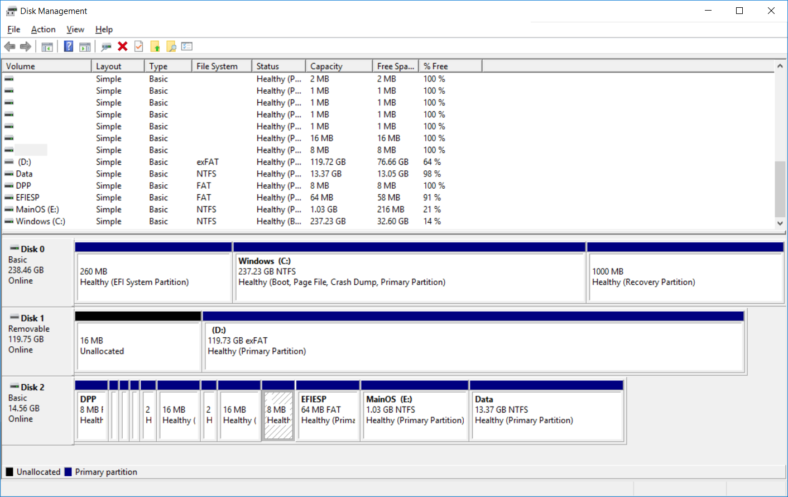
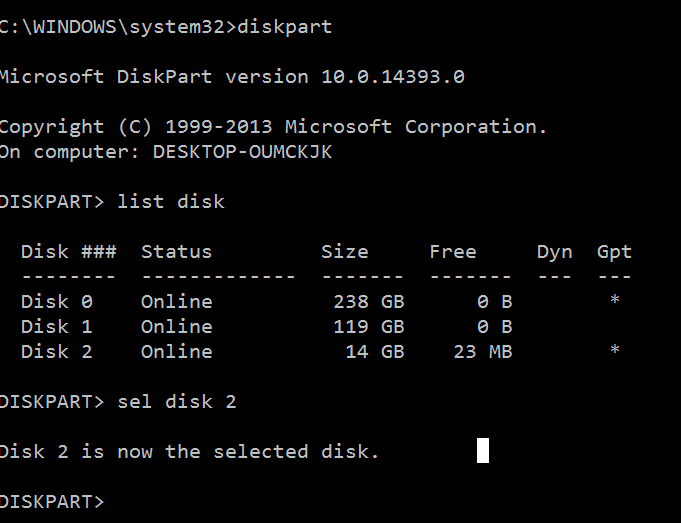
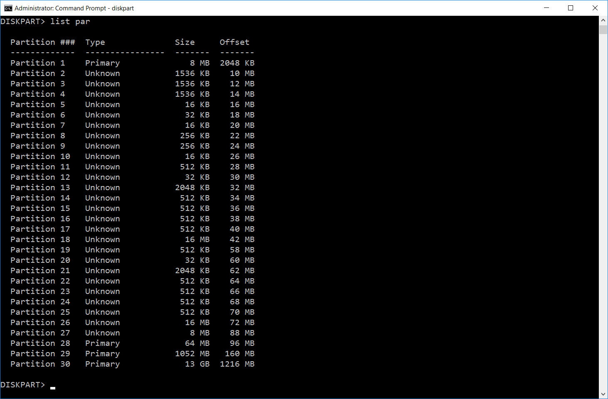
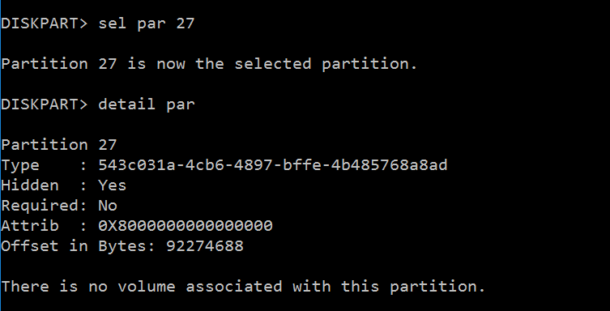
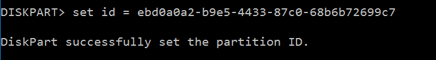
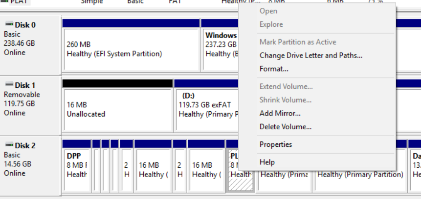
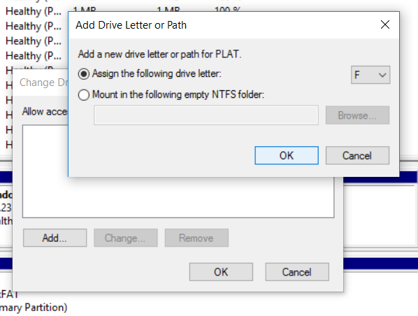
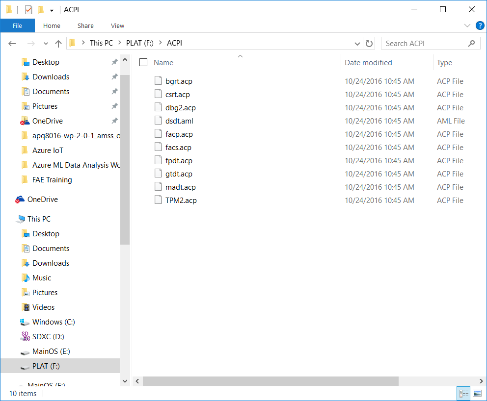
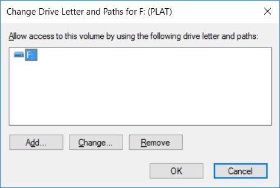

## FFU 생성 없이 Dragonboard Device layout 을 수정하여 ACPI 적용하기 

Dragonboard 410 의 전원 어댑터를 꽂기 전에 Power + RESET 버튼을 동시에 누른다. 
어댑터를 꽂으면 Mass Storage 로 PC 에 연결 됨 

FFU 생성 시 디스크 레이아웃은 BSP 폴더안에 DeviceLayout.xml 을 참조하여 레이아웃이 조정됨 

ACPI 테이블은 밑에서 네번째 파티션에 적용되어 있음 
ACPI 의 Type UUID 는 : 543C031A-4CB6-4897-BFFE-4B485768A8AD 임 

PC 의 실행창에 diskmgmt.msc 를 실행하여 확인 

Cmd 를 관리자로 실행하여 diskpart 실행 
List disk 와 sel disk 로 Mass Storage 선택 

List par 로 파티션 검색 

Sel par 27로 27번 파티션 선택 후 detail par 로 Type ID 설정 확인 

이제 Type ID 값을 FAT 테이블 ID 값으로 설정 ( FAT 의 ID 값은 ebd0a0a2-b9e5-4433-87c0-68b6b72699c7 ) 
Set id = ebd0a0a2-b9e5-4433-87c0-68b6b72699c7 실행 

이제 Disk 매니저에서 문자 할당 가능함 

F:\ACPI 의 경로로 가면 ACPI 의 컴파일 결과물을 확인할 수 있음 

교체 후 적용은 역으로 진행 
Letter 지움 

Diskpart 에서 27번 파티션 ID 값을 ACPI ID 로 되돌려 놓음
Set id = 543C031A-4CB6-4897-BFFE-4B485768A8AD 

